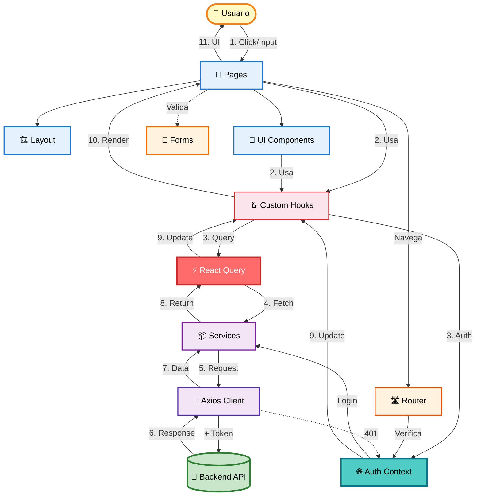

# Arquitectura del Frontend (Component-Based + Feature-Driven)

Este documento explica en profundidad cómo está construido el frontend, **por qué** se tomaron ciertas decisiones y cómo fluyen los datos a través del sistema React.

## 🏛️ Filosofía: Arquitectura Basada en Componentes + Features

En lugar de tener todo el código mezclado, organizamos el proyecto en **componentes reutilizables** y **features autocontenidos**. Cada pieza tiene una **responsabilidad única** y puede evolucionar independientemente.

### ¿Por qué hacemos esto?

Imagina una tienda de LEGO:

- **Los Bloques Básicos** (UI Components) son piezas reutilizables: botones, tarjetas, inputs.
- **Los Sets Temáticos** (Features) son colecciones completas: autenticación, catálogo de juegos, carrito.
- **Las Instrucciones** (Hooks) dicen cómo usar y combinar las piezas.
- **El Almacén** (Services) es donde pedimos más piezas cuando las necesitamos.

Si cada set viniera con sus propios bloques únicos que no puedes reusar, sería un desperdicio. En nuestro código pasa lo mismo.

---

## 🧩 Componentes del Sistema

### 1. Configuración (`src/lib/`)

Aquí viven las configuraciones globales de la aplicación.

- **`queryClient.ts`**: Configura React Query con políticas de caché, reintento y refetch. **Estrategia**: Datos frescos por 5 minutos, caché por 30 minutos.
- **`i18n.ts`**: Configura internacionalización con i18next. Actualmente carga solo inglés (español existe pero está desactivado).

### 2. Features (`src/features/`)

Cada feature es un **módulo autocontenido** con todo lo necesario para funcionar:

- **`auth/`**: Autenticación y sesión
  - `AuthContext.tsx`: Gestiona el estado global de autenticación
  - `hooks/`: useUpdateProfile
  - `pages/`: LoginPage, RegisterPage
  - `schemas.ts`: Validación con Zod
  - `types.ts`: Interfaces TypeScript
- **`games/`**: Catálogo de juegos
  - `hooks/`: useGames (infinite scroll), useGameDetails
  - `components/`: GameCard
- **`collection/`**: Biblioteca y wishlist
  - `hooks/`: useLibrary, useWishlist
  - `services/`: collection.service.ts
- **`checkout/`**: Proceso de compra
  - `hooks/`: useCheckout
  - `services/`: checkout.service.ts
- **`profile/`**: Perfil de usuario
  - `hooks/`: useUpdateProfile
  - `components/`: AvatarUploadModal

### 3. UI Components (`src/components/`)

Componentes reutilizables sin lógica de negocio:

- **`ui/`**: Componentes base
  - `Button.tsx`: Botón con variantes, tamaños y estado de carga
  - `Card.tsx`: Contenedor con efecto glassmorphism
  - `Input.tsx`: Input de formulario con validación visual
  - `SearchBar.tsx`: Barra de búsqueda con navegación
  - `ImageModal.tsx`: Modal para galería de imágenes
- **`layout/`**: Componentes de estructura
  - `MainLayout.tsx`: Layout principal con header/footer
  - `Navbar.tsx`: Navegación con menú móvil
  - `UserDropdown.tsx`: Dropdown de perfil de usuario

### 4. Pages (`src/pages/`)

Componentes de página que orquestan features y UI:

- `Home.tsx`: Catálogo principal con infinite scroll
- `GameDetails.tsx`: Detalles de juego con compra/wishlist
- `LibraryPage.tsx`: Biblioteca del usuario
- `CheckoutPage.tsx`: Proceso de pago
- `LandingPage.tsx`: Página de bienvenida
- `admin/`: Panel de administración

### 5. Services (`src/services/`)

Capa de comunicación con el backend. Cada servicio encapsula llamadas a la API:

- **`api.client.ts`**: Cliente Axios configurado con:
  - Base URL
  - Interceptores de request (añade token)
  - Interceptores de response (maneja 401)
- **`auth.service.ts`**: Login, register, logout, getProfile, updateProfile
- **`games.service.ts`**: getCatalog, getGameById
- **`checkout.service.ts`**: purchaseGame
- **`collection.service.ts`**: getLibrary, getWishlist, addToWishlist
- **`admin.service.ts`**: Operaciones CRUD para admin

### 6. Custom Hooks (`src/hooks/` y `src/features/*/hooks/`)

Encapsulan lógica reutilizable con React Query:

- **`useGames`**: Infinite scroll con paginación
- **`useGameDetails`**: Fetch de detalles de un juego
- **`useLibrary`**: Biblioteca del usuario (solo si autenticado)
- **`useWishlist`**: Gestión de wishlist con mutations
- **`useCheckout`**: Proceso de compra
- **`useAdmin`**: Operaciones de administración

### 7. Routing (`src/routes/`)

- **`AppRoutes.tsx`**: Configuración de rutas con React Router v7
  - Rutas públicas: `/`, `/home`, `/store`, `/game/:id`
  - Rutas protegidas: `/library`, `/checkout/:id`
  - Rutas admin: `/admin/*`
  - Componente `ProtectedRoute` para control de acceso

### 8. Utilities (`src/utils/`)

Funciones helper sin dependencias de React:

- **`format.ts`**: Formateo de moneda con Intl.NumberFormat

---

## 🎨 Gestión del Estado (State Management)

Usamos una **estrategia híbrida** según el tipo de estado:

### 1. Estado del Servidor (Server State)

**Herramienta**: React Query (TanStack Query)

**¿Por qué?** Los datos del servidor tienen necesidades especiales:

- Caché
- Sincronización
- Revalidación
- Paginación
- Optimistic updates

**Ejemplo**: Lista de juegos, detalles de usuario, biblioteca.

```typescript
// React Query maneja automáticamente:
// - Caché (5 min fresh, 30 min garbage collection)
// - Loading states
// - Error handling
// - Refetch on window focus (desactivado)
const { data, isLoading, error } = useGames({ limit: 12 });
```

### 2. Estado de Autenticación (Auth State)

**Herramienta**: Context API (`AuthContext`)

**¿Por qué?** El estado de autenticación:

- Es global (muchos componentes lo necesitan)
- Cambia poco
- Necesita persistencia (localStorage)

**Ejemplo**: Usuario actual, token, funciones login/logout.

### 3. Estado Local de UI (UI State)

**Herramienta**: `useState`, `useReducer`

**¿Por qué?** Estado que solo importa a un componente:

- Modales abiertos/cerrados
- Inputs de formulario (con react-hook-form)
- Índice de imagen en galería

---

## 🔐 Seguridad y Autenticación

### El Problema de la Sesión en SPA

Las Single Page Applications no recargan la página, pero necesitan mantener la sesión del usuario.

### Nuestra Solución: JWT + localStorage

1. **Login**:
   - Usuario envía credenciales
   - Backend valida y devuelve JWT token
   - Frontend guarda token en `localStorage`
2. **Peticiones Autenticadas**:
   - Interceptor de Axios añade `Authorization: Bearer <token>` automáticamente
   - Backend valida el token en cada request
3. **Logout**:
   - Frontend borra token de `localStorage`
   - Redirige a página pública

### Protección de Rutas

```typescript
// ProtectedRoute verifica autenticación
<ProtectedRoute>
  <LibraryPage />
</ProtectedRoute>

// También verifica roles (admin)
<ProtectedRoute requireAdmin>
  <AdminDashboard />
</ProtectedRoute>
```

---

## 🔄 Flujo de Datos: "La Vida de una Interacción del Usuario"

Veamos qué pasa exactamente cuando un usuario **añade un juego a la wishlist**:

1. **Interacción**: Usuario hace click en el botón ❤️ en `GameDetails.tsx`
2. **Event Handler**: Se ejecuta `handleToggleWishlist()`
3. **Hook**: Llama a `addToWishlist.mutate(gameId)` del hook `useWishlist`
4. **React Query Mutation**:
   - Marca el estado como `isLoading`
   - Ejecuta la función de mutación
5. **Service**: `collectionService.addToWishlist(gameId)`
6. **API Client**:
   - Axios interceptor añade el token
   - Envía `POST /collection/wishlist` con `{ gameId }`
7. **Backend**: Procesa la petición y guarda en BD
8. **Response**: Backend devuelve éxito
9. **React Query onSuccess**:
   - Invalida la query `["wishlist"]`
   - Refetch automático de la wishlist
10. **UI Update**:
    - React re-renderiza con los nuevos datos
    - El ícono cambia de ❤️ a ❤️ (filled)
    - El texto cambia a "In Wishlist"

### Optimistic Updates (Futuro)

Para mejorar la UX, podríamos actualizar la UI **antes** de que el servidor responda, y revertir si falla.

---

## 📊 Diagrama de Arquitectura



### Leyenda del Flujo

**Flujo de una petición (ej: añadir a wishlist):**

1. **Usuario → Pages**: Click en botón
2. **Pages → Hooks**: Invoca `useWishlist`
3. **Hooks → React Query**: Ejecuta mutation
4. **React Query → Services**: Llama `addToWishlist()`
5. **Services → API Client**: Prepara HTTP request
6. **API Client → Backend**: POST con token
7. **Backend → API Client**: Respuesta JSON
8. **API Client → Services**: Procesa datos
9. **Services → React Query**: Actualiza caché
10. **React Query → Hooks**: Notifica cambio
11. **Hooks → Pages**: Re-render
12. **Pages → Usuario**: UI actualizada ✨

### Capas por Color

- 🟦 **Azul**: Presentación (Pages, Layout, UI)
- 🟥 **Rosa/Rojo**: Lógica (Hooks, React Query, Context)
- 🟪 **Morado**: Datos (Services, API Client)
- 🟧 **Naranja**: Utilidades (Router, Forms)
- 🟨 **Amarillo**: Usuario
- 🟩 **Verde**: Backend

---

## 🎯 Patrones y Mejores Prácticas

### 1. Component Composition (Composición)

En lugar de componentes gigantes, componemos pequeños componentes:

```typescript
// ❌ Mal: Todo en un componente
<GameDetailsPage /> // 500 líneas

// ✅ Bien: Composición
<GameDetailsPage>
  <GameHero />
  <GameInfo />
  <PurchaseCard />
  <ScreenshotGallery />
</GameDetailsPage>
```

### 2. Custom Hooks para Lógica Reutilizable

Extraemos lógica compleja a hooks personalizados:

```typescript
// Encapsula: fetch, cache, mutations, invalidación
const { wishlist, addToWishlist, isInWishlist } = useWishlist();
```

### 3. Colocación de Estado (State Colocation)

El estado vive lo más cerca posible de donde se usa:

- **Local** (`useState`): Modal abierto/cerrado
- **Feature** (Context): Estado de auth
- **Global** (React Query): Datos del servidor

### 4. Separación de Concerns

- **Components**: Solo UI y eventos
- **Hooks**: Lógica de estado y side effects
- **Services**: Comunicación con API
- **Utils**: Funciones puras

---

## 🚀 Optimizaciones Implementadas

### 1. Code Splitting (Automático con Vite)

Vite divide automáticamente el código en chunks para carga más rápida.

### 2. React Query Cache

- Datos frescos por 5 minutos
- Caché por 30 minutos
- Evita peticiones redundantes

### 3. Infinite Scroll

En lugar de cargar 1000 juegos de golpe, cargamos 12 a la vez con `useInfiniteQuery`.

### 4. CSS Modules

Estilos con scope local para evitar conflictos y mejorar mantenibilidad.

### 5. Lazy Loading de Imágenes

Las imágenes se cargan solo cuando son visibles (nativo del navegador).

---

## 🔮 Próximas Mejoras (Roadmap)

### Corto Plazo

- [ ] Cargar traducciones al español
- [ ] Mover estilos inline restantes a CSS modules
- [ ] Implementar lógica de refresh token

### Medio Plazo

- [ ] Error Boundaries para manejo robusto de errores
- [ ] Optimistic Updates en mutations
- [ ] Service Workers para PWA

### Largo Plazo

- [ ] Server-Side Rendering (SSR) con Next.js
- [ ] Testing E2E con Playwright
- [ ] Storybook para documentación de componentes

---

## 📚 Decisiones Técnicas Clave

### ¿Por qué React Query en lugar de Redux?

- **React Query**: Especializado en estado del servidor (90% de nuestro estado)
- **Redux**: Mejor para estado de UI complejo (no es nuestro caso)
- **Resultado**: Menos código, mejor DX, caché automático

### ¿Por qué CSS Modules en lugar de Tailwind?

- **CSS Modules**: Máxima flexibilidad, scope local, fácil debug
- **Tailwind**: Más rápido pero menos control fino
- **Resultado**: Diseño glassmorphism personalizado imposible con Tailwind

### ¿Por qué Feature-Based en lugar de Type-Based?

```
// ❌ Type-Based (difícil de escalar)
/components
/hooks
/services

// ✅ Feature-Based (fácil de mantener)
/features/auth
  /components
  /hooks
  /services
```

**Ventaja**: Puedes borrar toda una feature sin afectar otras.

---

## 🎓 Conclusión

Esta arquitectura prioriza:

1. **Mantenibilidad**: Código organizado y fácil de entender
2. **Escalabilidad**: Fácil añadir nuevas features
3. **Performance**: Optimizaciones donde importan
4. **Developer Experience**: Herramientas modernas y patrones claros

El frontend no es solo "hacer que se vea bonito" - es una aplicación compleja que gestiona estado, caché, autenticación, routing y comunicación con el backend de forma eficiente y robusta.
