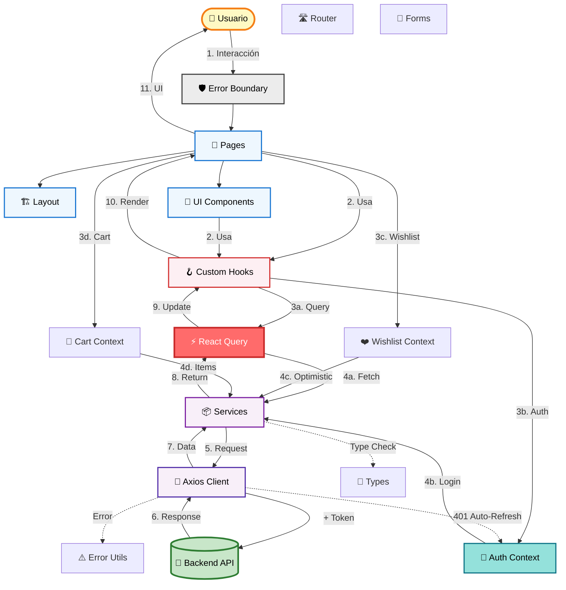
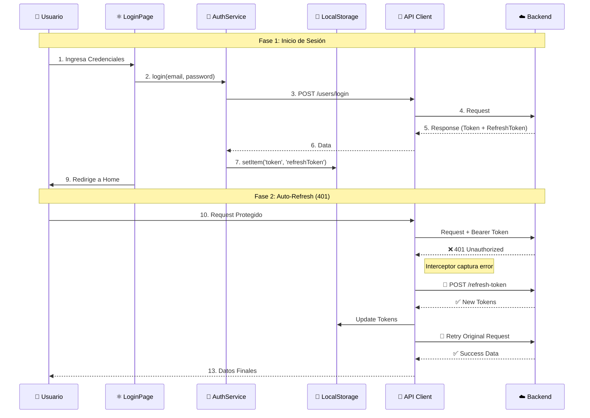
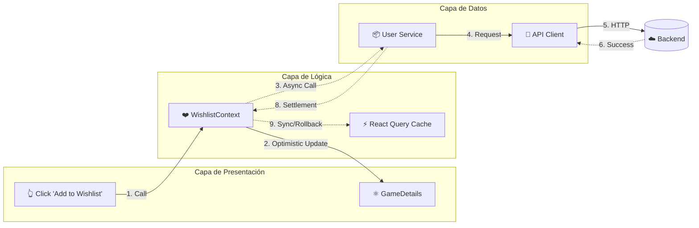
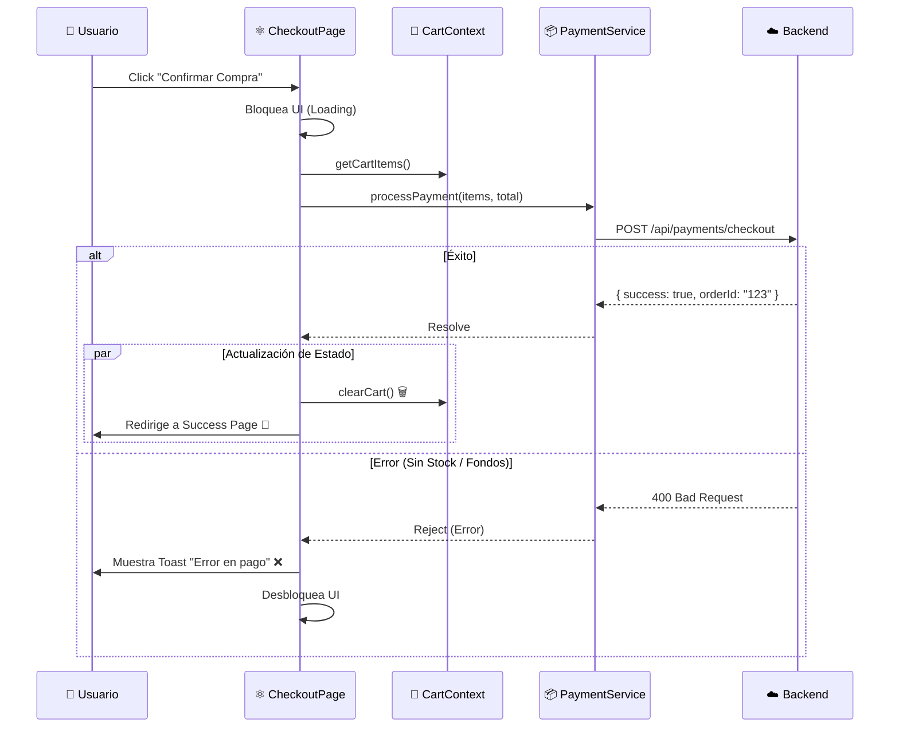
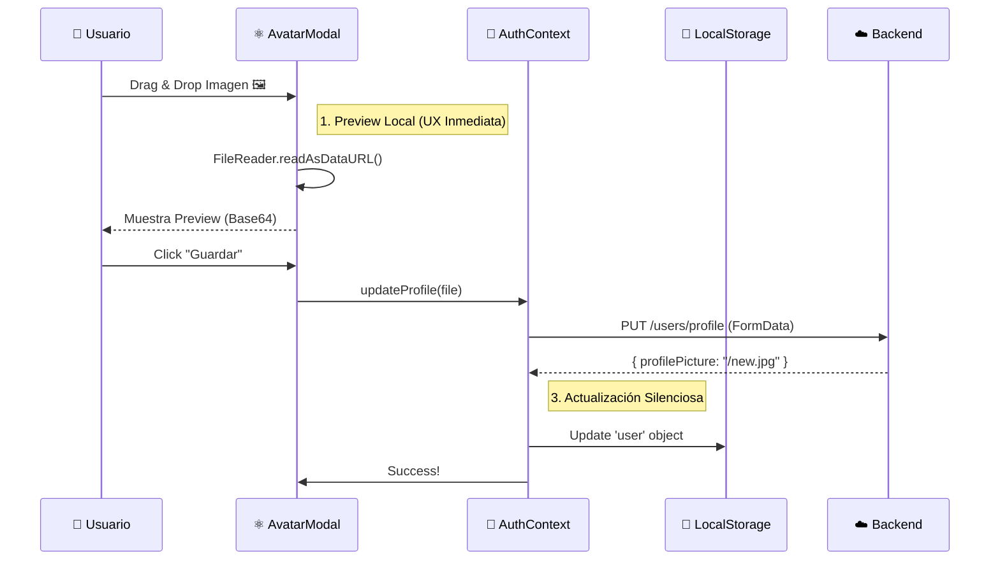

# Arquitectura del Frontend (Component-Based + Feature-Driven)

Este documento explica en profundidad cómo está construido el frontend, **por qué** se tomaron ciertas decisiones y cómo fluyen los datos a través del sistema React.

## 🏛️ Filosofía: Arquitectura Basada en Componentes + Features

En lugar de tener todo el código mezclado, organizamos el proyecto en **componentes reutilizables** y **features autocontenidos**. Cada pieza tiene una **responsabilidad única** y puede evolucionar independientemente.

### ¿Por qué hacemos esto?

Imagina una tienda de LEGO:

- **Los Bloques Básicos** (UI Components) son piezas reutilizables: botones, tarjetas, inputs.
- **Los Sets Temáticos** (Features) son colecciones completas: autenticación, catálogo de juegos, carrito.
- **Las Instrucciones** (Hooks) dicen cómo usar y combinar las piezas.
- **El Almacén** (Services) es donde pedimos más piezas cuando las necesitamos.

Si cada set viniera con sus propios bloques únicos que no puedes reusar, sería un desperdicio. En nuestro código pasa lo mismo.

---

## 🧩 Componentes del Sistema (Capas Detalladas)

### 1. Configuración (`src/lib/`)

Aquí viven las configuraciones globales de la aplicación.

- **`queryClient.ts`**: Configura React Query con políticas de caché, reintento y refetch. **Estrategia**: Datos frescos por 5 minutos, caché por 30 minutos.
- **`i18n.ts`**: Configura internacionalización con i18next. Actualmente carga solo inglés (español existe pero está desactivado).

### 1.1. Tipos (`src/types/`)

Definiciones TypeScript centralizadas para type safety:

- **`api.types.ts`**: Interfaces para respuestas de API y manejo de errores
  - `ApiError`: Estructura estandarizada de errores del backend
  - `isApiError()`: Type guard para validación segura de errores
  - `GamesApiResponse`: Respuesta paginada del catálogo
- **`rawg.types.ts`**: Interfaces para integración con RAWG API
  - `RAWGGame`: Estructura completa de juegos de RAWG
  - `RAWGSearchResponse`: Respuesta de búsqueda con paginación

### 2. Features (`src/features/`)

Cada feature es un **módulo autocontenido** con todo lo necesario para funcionar:

- **`auth/`**: Autenticación y sesión
  - `AuthContext.tsx`: Gestiona el estado global de autenticación
  - `hooks/`: `useUpdateProfile`
  - `pages/`: `LoginPage`, `RegisterPage`
  - `schemas.ts`: Validación con Zod
  - `types.ts`: Interfaces TypeScript especificas
- **`games/`**: Catálogo de juegos
  - `hooks/`: `useGames` (infinite scroll), `useGameDetails`
  - `components/`: `GameCard`
- **`collection/`**: Biblioteca y wishlist
  - `hooks/`: `useLibrary`, `useWishlist` (Mutation hooks)
  - `services/`: `collection.service.ts`
- **`wishlist/`**: Gestión de lista de deseos (Context-based)
  - `WishlistContext.tsx`: Context API para wishlist con **optimistic updates**
  - Alternativa a `useWishlist` hook, usado por `WishlistPage` para mejor UX
- **`cart/`**: Carrito de compras
  - `CartContext.tsx`: Context API para carrito con persistencia en localStorage
  - Gestión de items, total y contador
- **`checkout/`**: Proceso de compra
  - `hooks/`: `useCheckout`
  - `services/`: `checkout.service.ts`
- **`profile/`**: Perfil de usuario
  - `hooks/`: `useUpdateProfile`
  - `components/`: `AvatarUploadModal` (Drag & Drop)

### 3. UI Components (`src/components/`)

Componentes reutilizables sin lógica de negocio:

- **`ui/`**: Componentes base
  - `Button.tsx`: Botón con variantes, tamaños y estado de carga animado (⏳)
  - `Card.tsx`: Contenedor con efecto glassmorphism
  - `Input.tsx`: Input de formulario con validación visual
  - `SearchBar.tsx`: Barra de búsqueda con navegación
  - `ImageModal.tsx`: Modal para galería de imágenes
  - `Loader.tsx`: Spinner de carga con tamaños configurables (sm/md/lg)
- **`layout/`**: Componentes de estructura
  - `MainLayout.tsx`: Layout principal con header/footer
  - `Navbar.tsx`: Navegación con menú móvil y glassmorphism
  - `UserDropdown.tsx`: Dropdown de perfil de usuario
- **`ErrorBoundary.tsx`**: Componente de manejo de errores
  - Captura errores de React en toda la aplicación
  - UI fallback amigable con glassmorphism
  - Botones de refresh y retry

### 4. Pages (`src/pages/`)

Componentes de página que orquestan features y UI:

- `Home.tsx`: Catálogo principal con infinite scroll
- `GameDetails.tsx`: Detalles de juego con compra/wishlist
- `LibraryPage.tsx`: Biblioteca del usuario
- `WishlistPage.tsx`: Lista de deseos del usuario con grid de juegos
- `CheckoutPage.tsx`: Proceso de pago
- `LandingPage.tsx`: Página de bienvenida
- `StorePage.tsx`: Página de tienda (placeholder "Coming Soon")
- `admin/`: Panel de administración

### 5. Services (`src/services/`)

Capa de comunicación con el backend. Cada servicio encapsula llamadas a la API:

- **`api.client.ts`**: Cliente Axios configurado con:
  - Base URL
  - Interceptores de request (añade token automáticamente)
  - Interceptores de response (maneja 401 con refresh token)
  - **Auto-refresh de tokens**: Detecta tokens expirados, refresca automáticamente y reintenta la petición
- **`auth.service.ts`**: Login, register, logout, getProfile, updateProfile, refreshToken
  - Gestiona tanto access token como refresh token
- **`games.service.ts`**: `getCatalog`, `getGameById`
- **`checkout.service.ts`**: `purchaseGame`
- **`collection.service.ts`**: `getLibrary`, `getWishlist`, `addToWishlist` (hook-based)
- **`user.service.ts`**: `getWishlist`, `addToWishlist`, `removeFromWishlist` (context-based)

### 6. Custom Hooks (`src/hooks/`)

Encapsulan lógica reutilizable con React Query:

- **`useGames`**: Infinite scroll con paginación
- **`useGameDetails`**: Fetch de detalles de un juego
- **`useLibrary`**: Biblioteca del usuario (solo si autenticado)
- **`useWishlist`**: Gestión de wishlist con mutations
- **`useCheckout`**: Proceso de compra
- **`useAdmin`**: Operaciones de administración

### 7. Routing (`src/routes/`)

- **`AppRoutes.tsx`**: Configuración de rutas con React Router v7
  - Rutas públicas: `/`, `/home`, `/store`, `/game/:id`
  - Rutas protegidas: `/library`, `/checkout/:id`
  - Rutas admin: `/admin/*`
  - Componente `ProtectedRoute` para control de acceso

### 8. Utilities (`src/utils/`)

Funciones helper sin dependencias de React:

- **`format.ts`**: Formateo de moneda con Intl.NumberFormat
- **`error.util.ts`**: Utilidades centralizadas de manejo de errores
  - `logger`: Logging condicional (solo en desarrollo)
  - `getErrorMessage()`: Extrae mensajes de error de forma segura
  - `handleApiError()`: Manejo estandarizado con toast + logging

---

## 📊 Diagrama de Arquitectura (Vista General)

Este diagrama muestra la relación macro entre las capas del sistema.

---

## 🔄 Dynamic Flows: Flujos Clave de Lógica

Aquí desglosamos los flujos de datos más complejos e importantes de la aplicación.

### 1. Flujo de Autenticación (Dual Token)

**Concepto**: JWT con Access Token (corta duración) y Refresh Token (larga duración) con rotación automática.

### 2. Flujo de Wishlist (Optimistic Updates)

**Concepto**: UX Perceptiva. La interfaz responde _antes_ que el servidor.

**Paso a paso textual**:

1. Usuario hace click en el botón ❤️.
2. `WishlistContext` actualiza el estado local inmediatamente -> ❤️ se rellena.
3. Se lanza la petición al servidor en segundo plano.
4. Si el servidor responde OK: Se muestra un Toast discreto.
5. Si el error falla: Se hace **rollback** automático del estado (❤️ se vacía) y se avisa al usuario.

### 3. Flujo Checkout & Payment (Complejo de Negocio)

**Concepto**: Orquestación entre contextos y servicios transaccionales.

### 4. Flujo Upload de Avatar (Manejo de Archivos)

**Concepto**: Manejo de BLOBs y UX inmediata.

---

## 🎯 Arquitectura y Patrones de Diseño

Definimos nuestro estilo arquitectónico como **"Feature-Driven Modular Architecture with Component Composition"**.

Esta arquitectura se sostiene sobre **4 Pilares Fundamentales** que garantizan escalabilidad y mantenibilidad:

### 1. Feature-Driven Structure (Vertical Slicing)

En lugar de organizar el código por capas técnicas (horizontal), lo organizamos por **dominios de negocio** (vertical).

- **Antes**: Una carpeta gigante `/components` y otra `/pages`.
- **Ahora**: `/features/auth`, `/features/games`. Cada carpeta contiene _todo_ lo necesario para esa funcionalidad (sus componentes, sus hooks, sus servicios).
- **Beneficio**: Mantenibilidad extrema. Puedes borrar o refactorizar una feature sin miedo a romper otras partes del sistema.

### 2. Component Composition (LEGO Pattern)

Evitamos los "componentes monolíticos" (God Components). Construimos interfaces complejas ensamblando piezas pequeñas y reutilizables.

- **Patrón**: `GameDetailsPage` actúa como orquestador, ensamblando `<GameHero>`, `<GameInfo>` y `<PurchaseCard>`.
- **Beneficio**: Reutilización de código y tests unitarios más sencillos.

### 3. Separation of Concerns via Custom Hooks

Desacoplamos totalmente la UI de la Lógica.

- **Regla**: Los componentes visuales (JSX) **no deben** contener lógica de negocio compleja ni llamadas directas a la API.
- **Solución**: Custom Hooks (`useWishlist`, `useGames`) encapsulan el estado, efectos y llamadas a servicios.
- **Beneficio**: Te permite cambiar la implementación lógica (ej: migrar de Context a Redux) sin tocar una sola línea de la UI.

### 4. Hybrid State Strategy (Pragmatismo)

No usamos una "bala de plata" para el estado. Usamos la herramienta correcta para cada necesidad:

- **Server State (Datos Asíncronos)** → **React Query** (Caché, revalidación, deduplicación).
- **Global Client State (Sesión)** → **Context API** (Auth, Theme).
- **Ephemeral UI State (Local)** → **useState** (Formularios, Modales).

---

## 🎨 Gestión del Estado (Resumen)

| Tipo de Estado   | Herramienta      | Ejemplo                   |
| :--------------- | :--------------- | :------------------------ |
| **Server State** | React Query      | Lista de juegos, Detalles |
| **Auth State**   | Context API      | Usuario, Tokens           |
| **UI State**     | useState / Props | Formularios, Pestañas     |

---

## 🔐 Seguridad y Autenticación (Detalle Técnico)

1.  **Dual Token**:
    - **Access Token**: 15 min de vida. Se envía en header `Authorization`.
    - **Refresh Token**: 7 días de vida. Se usa solo para obtener nuevos access tokens.
2.  **Protección de Rutas**:
    - Wrapper `<ProtectedRoute>` verifica existencia de token valido.
    - Prop `requireAdmin` verifica `user.role === 'admin'`.
3.  **Auto-Refresh**:
    - Implementado via Axios Interceptors(`src/services/api.client.ts`).

---

## 🔮 Roadmap Actualizado

### Corto Plazo

- [x] ~~Implementar lógica de refresh token~~ ✅ Completado
- [x] ~~Error Boundaries para manejo robusto de errores~~ ✅ Completado
- [x] ~~Type safety al 95%~~ ✅ Completado
- [x] ~~Cargar traducciones al español~~ ✅ Implementado (Listo para activar)
- [ ] Mover estilos inline restantes a CSS modules

### Medio Plazo

- [ ] Optimistic Updates en mutations (Wishlist ✅)
- [ ] Service Workers para PWA
- [ ] Integración con Sentry para tracking

### Largo Plazo

- [ ] Server-Side Rendering (SSR) con Next.js
- [ ] Testing E2E con Playwright
- [ ] Storybook para documentación
