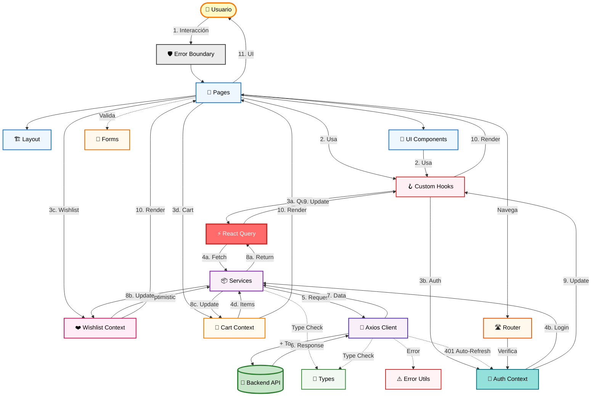

# Arquitectura del Frontend (Component-Based + Feature-Driven)

Este documento explica en profundidad cómo está construido el frontend, **por qué** se tomaron ciertas decisiones y cómo fluyen los datos a través del sistema React.

## 🏛️ Filosofía: Arquitectura Basada en Componentes + Features

En lugar de tener todo el código mezclado, organizamos el proyecto en **componentes reutilizables** y **features autocontenidos**. Cada pieza tiene una **responsabilidad única** y puede evolucionar independientemente.

### ¿Por qué hacemos esto?

Imagina una tienda de LEGO:

- **Los Bloques Básicos** (UI Components) son piezas reutilizables: botones, tarjetas, inputs.
- **Los Sets Temáticos** (Features) son colecciones completas: autenticación, catálogo de juegos, carrito.
- **Las Instrucciones** (Hooks) dicen cómo usar y combinar las piezas.
- **El Almacén** (Services) es donde pedimos más piezas cuando las necesitamos.

Si cada set viniera con sus propios bloques únicos que no puedes reusar, sería un desperdicio. En nuestro código pasa lo mismo.

---

## 🧩 Componentes del Sistema

### 1. Configuración (`src/lib/`)

Aquí viven las configuraciones globales de la aplicación.

- **`queryClient.ts`**: Configura React Query con políticas de caché, reintento y refetch. **Estrategia**: Datos frescos por 5 minutos, caché por 30 minutos.
- **`i18n.ts`**: Configura internacionalización con i18next. Actualmente carga solo inglés (español existe pero está desactivado).

### 1.1. Tipos (`src/types/`)

Definiciones TypeScript centralizadas para type safety:

- **`api.types.ts`**: Interfaces para respuestas de API y manejo de errores
  - `ApiError`: Estructura estandarizada de errores del backend
  - `isApiError()`: Type guard para validación segura de errores
  - `GamesApiResponse`: Respuesta paginada del catálogo
- **`rawg.types.ts`**: Interfaces para integración con RAWG API
  - `RAWGGame`: Estructura completa de juegos de RAWG
  - `RAWGSearchResponse`: Respuesta de búsqueda con paginación

### 2. Features (`src/features/`)

Cada feature es un **módulo autocontenido** con todo lo necesario para funcionar:

- **`auth/`**: Autenticación y sesión
  - `AuthContext.tsx`: Gestiona el estado global de autenticación
  - `hooks/`: useUpdateProfile
  - `pages/`: LoginPage, RegisterPage
  - `schemas.ts`: Validación con Zod
  - `types.ts`: Interfaces TypeScript
- **`games/`**: Catálogo de juegos
  - `hooks/`: useGames (infinite scroll), useGameDetails
  - `components/`: GameCard
- **`collection/`**: Biblioteca y wishlist
  - `hooks/`: useLibrary, useWishlist
  - `services/`: collection.service.ts
- **`wishlist/`**: Gestión de lista de deseos (Context-based)
  - `WishlistContext.tsx`: Context API para wishlist con optimistic updates
  - Alternativa a `useWishlist` hook, usado por WishlistPage
- **`cart/`**: Carrito de compras
  - `CartContext.tsx`: Context API para carrito con persistencia en localStorage
  - Gestión de items, total y contador
- **`checkout/`**: Proceso de compra
  - `hooks/`: useCheckout
  - `services/`: checkout.service.ts
- **`profile/`**: Perfil de usuario
  - `hooks/`: useUpdateProfile
  - `components/`: AvatarUploadModal

### 3. UI Components (`src/components/`)

Componentes reutilizables sin lógica de negocio:

- **`ui/`**: Componentes base
  - `Button.tsx`: Botón con variantes, tamaños y estado de carga animado (⏳)
  - `Card.tsx`: Contenedor con efecto glassmorphism
  - `Input.tsx`: Input de formulario con validación visual
  - `SearchBar.tsx`: Barra de búsqueda con navegación
  - `ImageModal.tsx`: Modal para galería de imágenes
  - `Loader.tsx`: Spinner de carga con tamaños configurables (sm/md/lg)
- **`layout/`**: Componentes de estructura
  - `MainLayout.tsx`: Layout principal con header/footer
  - `Navbar.tsx`: Navegación con menú móvil
  - `UserDropdown.tsx`: Dropdown de perfil de usuario
- **`ErrorBoundary.tsx`**: Componente de manejo de errores
  - Captura errores de React en toda la aplicación
  - UI fallback amigable con glassmorphism
  - Botones de refresh y retry
  - Detalles de error solo en desarrollo

### 4. Pages (`src/pages/`)

Componentes de página que orquestan features y UI:

- `Home.tsx`: Catálogo principal con infinite scroll
- `GameDetails.tsx`: Detalles de juego con compra/wishlist
- `LibraryPage.tsx`: Biblioteca del usuario
- `WishlistPage.tsx`: Lista de deseos del usuario con grid de juegos
- `CheckoutPage.tsx`: Proceso de pago
- `LandingPage.tsx`: Página de bienvenida
- `StorePage.tsx`: Página de tienda (placeholder "Coming Soon")
- `admin/`: Panel de administración

### 5. Services (`src/services/`)

Capa de comunicación con el backend. Cada servicio encapsula llamadas a la API:

- **`api.client.ts`**: Cliente Axios configurado con:
  - Base URL
  - Interceptores de request (añade token automáticamente)
  - Interceptores de response (maneja 401 con refresh token)
  - **Auto-refresh de tokens**: Detecta tokens expirados, refresca automáticamente y reintenta la petición
- **`auth.service.ts`**: Login, register, logout, getProfile, updateProfile, refreshToken
  - Gestiona tanto access token como refresh token
  - Almacena ambos tokens en localStorage
- **`games.service.ts`**: getCatalog, getGameById
- **`checkout.service.ts`**: purchaseGame
- **`collection.service.ts`**: getLibrary, getWishlist, addToWishlist (hook-based)
- **`user.service.ts`**: getWishlist, addToWishlist, removeFromWishlist (context-based)
  - Sistema alternativo usado por WishlistContext
  - Nota: Existe duplicación con collection.service para compatibilidad
- **`admin.service.ts`**: Operaciones CRUD para admin

### 6. Custom Hooks (`src/hooks/` y `src/features/*/hooks/`)

Encapsulan lógica reutilizable con React Query:

- **`useGames`**: Infinite scroll con paginación
- **`useGameDetails`**: Fetch de detalles de un juego
- **`useLibrary`**: Biblioteca del usuario (solo si autenticado)
- **`useWishlist`**: Gestión de wishlist con mutations
- **`useCheckout`**: Proceso de compra
- **`useAdmin`**: Operaciones de administración

### 7. Routing (`src/routes/`)

- **`AppRoutes.tsx`**: Configuración de rutas con React Router v7
  - Rutas públicas: `/`, `/home`, `/store`, `/game/:id`
  - Rutas protegidas: `/library`, `/checkout/:id`
  - Rutas admin: `/admin/*`
  - Componente `ProtectedRoute` para control de acceso

### 8. Utilities (`src/utils/`)

Funciones helper sin dependencias de React:

- **`format.ts`**: Formateo de moneda con Intl.NumberFormat
- **`error.util.ts`**: Utilidades centralizadas de manejo de errores
  - `logger`: Logging condicional (solo en desarrollo)
  - `getErrorMessage()`: Extrae mensajes de error de forma segura
  - `handleApiError()`: Manejo estandarizado con toast + logging
  - `withErrorHandling()`: Wrapper para operaciones async con try/catch automático

---

## 🎨 Gestión del Estado (State Management)

Usamos una **estrategia híbrida** según el tipo de estado:

### 1. Estado del Servidor (Server State)

**Herramienta**: React Query (TanStack Query)

**¿Por qué?** Los datos del servidor tienen necesidades especiales:

- Caché
- Sincronización
- Revalidación
- Paginación
- Optimistic updates

**Ejemplo**: Lista de juegos, detalles de usuario, biblioteca.

```typescript
// React Query maneja automáticamente:
// - Caché (5 min fresh, 30 min garbage collection)
// - Loading states
// - Error handling
// - Refetch on window focus (desactivado)
const { data, isLoading, error } = useGames({ limit: 12 });
```

### 2. Estado de Autenticación (Auth State)

**Herramienta**: Context API (`AuthContext`)

**¿Por qué?** El estado de autenticación:

- Es global (muchos componentes lo necesitan)
- Cambia poco
- Necesita persistencia (localStorage)

**Ejemplo**: Usuario actual, token, funciones login/logout.

### 3. Estado Local de UI (UI State)

**Herramienta**: `useState`, `useReducer`

**¿Por qué?** Estado que solo importa a un componente:

- Modales abiertos/cerrados
- Inputs de formulario (con react-hook-form)
- Índice de imagen en galería

---

## 🔐 Seguridad y Autenticación

### El Problema de la Sesión en SPA

Las Single Page Applications no recargan la página, pero necesitan mantener la sesión del usuario.

### Nuestra Solución: JWT Dual Token + Auto-Refresh

1. **Login**:

   - Usuario envía credenciales
   - Backend valida y devuelve **dos tokens**:
     - **Access Token**: Corta duración (15 minutos)
     - **Refresh Token**: Larga duración (7 días)
   - Frontend guarda ambos en `localStorage`

2. **Peticiones Autenticadas**:

   - Interceptor de Axios añade `Authorization: Bearer <accessToken>` automáticamente
   - Backend valida el token en cada request

3. **Auto-Refresh de Tokens** (Transparente para el usuario):

   - Si el servidor responde 401 (token expirado):
     1. Interceptor detecta el error
     2. Envía el refresh token al endpoint `/users/refresh-token`
     3. Backend valida y devuelve nuevos tokens
     4. Frontend actualiza ambos tokens en localStorage
     5. **Reintenta la petición original automáticamente**
   - Si el refresh token también expiró → logout automático

4. **Logout**:
   - Frontend borra ambos tokens de `localStorage`
   - Redirige a página pública

### Protección de Rutas

```typescript
// ProtectedRoute verifica autenticación
<ProtectedRoute>
  <LibraryPage />
</ProtectedRoute>

// También verifica roles (admin)
<ProtectedRoute requireAdmin>
  <AdminDashboard />
</ProtectedRoute>
```

### Ventajas del Sistema Dual Token

- ✅ **Seguridad mejorada**: Access tokens de corta duración limitan ventana de ataque
- ✅ **UX sin interrupciones**: Usuario nunca ve logout forzado durante sesión activa
- ✅ **Sesiones extendidas**: 7 días de sesión vs 15 minutos
- ✅ **Transparencia total**: Refresh ocurre en background sin intervención del usuario

---

## 🔄 Flujo de Datos: "La Vida de una Interacción del Usuario"

Veamos qué pasa exactamente cuando un usuario **añade un juego a la wishlist**:

### Opción 1: Sistema Hook-Based (collection)

1. **Interacción**: Usuario hace click en el botón ❤️ en `GameDetails.tsx`
2. **Event Handler**: Se ejecuta `handleToggleWishlist()`
3. **Hook**: Llama a `addToWishlist.mutate(gameId)` del hook `useWishlist`
4. **React Query Mutation**:
   - Marca el estado como `isLoading`
   - Ejecuta la función de mutación
5. **Service**: `collectionService.addToWishlist(gameId)`
6. **API Client**:
   - Axios interceptor añade el token
   - Envía `POST /collection/wishlist` con `{ gameId }`
7. **Backend**: Procesa la petición y guarda en BD
8. **Response**: Backend devuelve éxito
9. **React Query onSuccess**:
   - Invalida la query `["wishlist"]`
   - Refetch automático de la wishlist
10. **UI Update**:
    - React re-renderiza con los nuevos datos
    - El ícono cambia de ❤️ a ❤️ (filled)
    - El texto cambia a "In Wishlist"

### Opción 2: Sistema Context-Based (WishlistContext)

1. **Interacción**: Usuario hace click en botón de wishlist
2. **Event Handler**: Llama a `addToWishlist(game)` del Context
3. **Optimistic Update**: UI se actualiza inmediatamente (UX mejorada)
4. **API Call**: `user.service.addToWishlist(gameId)`
5. **Success**: Toast de confirmación
6. **Error**: Rollback automático + toast de error

**Nota**: Ambos sistemas coexisten para compatibilidad. WishlistContext ofrece optimistic updates para mejor UX.

### Optimistic Updates (Implementado en WishlistContext)

Para mejorar la UX, `WishlistContext` actualiza la UI **antes** de que el servidor responda:

1. Usuario hace click → UI se actualiza inmediatamente
2. Petición al servidor en background
3. Si falla → Rollback automático + notificación de error
4. Si éxito → Confirmación con toast

**Ventaja**: Usuario no espera, la app se siente más rápida y responsive.

---

## 📊 Diagrama de Arquitectura


```mermaid
flowchart TB
    %% ============================================
    %% EXTERNOS
    %% ============================================
    User([👤 Usuario])
    Backend[(🔌 Backend API)]

    %% ============================================
    %% CAPA 0: PROTECCIÓN
    %% ============================================
    ErrorBoundary[🛡️ Error Boundary]

    %% ============================================
    %% CAPA 1: PRESENTACIÓN
    %% ============================================
    Pages[📄 Pages]
    Layout[🏗️ Layout]
    UI[🧩 UI Components]

    %% ============================================
    %% CAPA 2: LÓGICA
    %% ============================================
    Hooks[🪝 Custom Hooks]
    ReactQuery[⚡ React Query]
    AuthContext[🔐 Auth Context]
    WishlistContext[❤️ Wishlist Context]
    CartContext[🛒 Cart Context]

    %% ============================================
    %% CAPA 3: DATOS
    %% ============================================
    Services[📦 Services]
    APIClient[🔧 Axios Client]

    %% ============================================
    %% CAPA 4: TYPES & UTILIDADES
    %% ============================================
    Types[📐 Types]
    ErrorUtils[⚠️ Error Utils]
    Router[🛣️ Router]
    Forms[📝 Forms]

    %% ============================================
    %% FLUJO DE DATOS (Respetando Capas)
    %% ============================================

    %% Externos → Protección
    User -->|1. Interacción| ErrorBoundary

    %% Protección → Presentación
    ErrorBoundary --> Pages

    %% Dentro de Presentación (lateral)
    Pages --> Layout
    Pages --> UI

    %% Presentación → Lógica
    Pages -->|2. Usa| Hooks
    UI -->|2. Usa| Hooks

    %% Dentro de Lógica (lateral)
    Hooks -->|3a. Query| ReactQuery
    Hooks -->|3b. Auth| AuthContext
    Pages -->|3c. Wishlist| WishlistContext
    Pages -->|3d. Cart| CartContext

    %% Lógica → Datos
    ReactQuery -->|4a. Fetch| Services
    AuthContext -->|4b. Login| Services
    WishlistContext -->|4c. Optimistic| Services
    CartContext -->|4d. Items| Services

    %% Dentro de Datos (lateral)
    Services -->|5. Request| APIClient

    %% Datos → Backend
    APIClient -->|+ Token| Backend

    %% Datos ↔ Utilidades (transversal)
    Services -.->|Type Check| Types
    APIClient -.->|Type Check| Types
    APIClient -.->|Error| ErrorUtils

    %% Backend → Datos (respuesta)
    Backend -->|6. Response| APIClient

    %% Transversal: Auto-refresh
    APIClient -.->|401 Auto-Refresh| AuthContext

    %% Datos → Lógica (retorno)
    APIClient -->|7. Data| Services
    Services -->|8a. Return| ReactQuery
    Services -->|8b. Update| WishlistContext
    Services -->|8c. Update| CartContext

    %% Lógica → Presentación (render)
    ReactQuery -->|9. Update| Hooks
    AuthContext -->|9. Update| Hooks
    Hooks -->|10. Render| Pages
    WishlistContext -->|10. Render| Pages
    CartContext -->|10. Render| Pages

    %% Presentación → Usuario (UI)
    Pages -->|11. UI| User

    %% Utilidades transversales
    Pages -->|Navega| Router
    Router -->|Verifica| AuthContext
    Pages -.->|Valida| Forms

    %% ============================================
    %% ESTILOS (Por Capas con Transparencia)
    %% ============================================

    %% Externos (Amarillo/Verde - Opacos)
    style User fill:#FFF9C4,stroke:#F57F17,stroke-width:3px,color:#000
    style Backend fill:#C8E6C9,stroke:#2E7D32,stroke-width:3px,color:#000

    %% Protección (Gris - Semi-transparente)
    style ErrorBoundary fill:#E0E0E099,stroke:#424242,stroke-width:2px,color:#000

    %% Presentación (Azul - Transparente)
    style Pages fill:#E3F2FD99,stroke:#1976D2,stroke-width:2px,color:#000
    style Layout fill:#E3F2FD99,stroke:#1976D2,stroke-width:2px,color:#000
    style UI fill:#E3F2FD99,stroke:#1976D2,stroke-width:2px,color:#000

    %% Lógica (Rosa/Rojo - Transparente, Contexts con variaciones)
    style Hooks fill:#FCE4EC99,stroke:#D32F2F,stroke-width:2px,color:#000
    style ReactQuery fill:#FF6B6B,stroke:#C92A2A,stroke-width:3px,color:#FFF
    style AuthContext fill:#4ECDC499,stroke:#0B7285,stroke-width:2px,color:#000
    style WishlistContext fill:#FFE0F099,stroke:#C2185B,stroke-width:2px,color:#000
    style CartContext fill:#FFF9E699,stroke:#F57C00,stroke-width:2px,color:#000

    %% Datos (Morado - Transparente)
    style Services fill:#F3E5F599,stroke:#7B1FA2,stroke-width:2px,color:#000
    style APIClient fill:#F3E5F599,stroke:#512DA8,stroke-width:2px,color:#000

    %% Types & Utilidades (Verde/Naranja - Transparente)
    style Types fill:#E8F5E999,stroke:#388E3C,stroke-width:2px,color:#000
    style ErrorUtils fill:#FFEBEE99,stroke:#D32F2F,stroke-width:2px,color:#000
    style Router fill:#FFF3E099,stroke:#E65100,stroke-width:2px,color:#000
    style Forms fill:#FFF3E099,stroke:#EF6C00,stroke-width:2px,color:#000
```

### Leyenda del Flujo

**Flujo Hook-Based (React Query):**

1. **Usuario → ErrorBoundary → Pages**: Click en botón
2. **Pages → Hooks**: Invoca `useWishlist`
3. **Hooks → React Query**: Ejecuta mutation
4. **React Query → Services**: Llama `addToWishlist()`
5. **Services → API Client**: Prepara HTTP request
6. **API Client → Backend**: POST con token
7. **Backend → API Client**: Respuesta JSON
8. **API Client → Services**: Procesa datos
9. **Services → React Query**: Actualiza caché
10. **React Query → Hooks**: Notifica cambio
11. **Hooks → Pages**: Re-render
12. **Pages → Usuario**: UI actualizada ✨

**Flujo Context-Based (Optimistic Updates):**

1. **Usuario → Pages → WishlistContext**: Click en botón
2. **WishlistContext**: Actualiza UI inmediatamente (optimistic)
3. **WishlistContext → Services → API Client → Backend**: Petición en background
4. **Si éxito**: Toast de confirmación
5. **Si error**: Rollback automático + notificación

**Flujo de Auto-Refresh (401):**

1. **API Client** recibe 401 → Detecta token expirado
2. **API Client → Auth Context**: Solicita refresh de tokens
3. **Auth Context**: Obtiene nuevos tokens del backend
4. **API Client**: Reintenta petición original con nuevo token

### Capas de la Arquitectura

**Capa 0 - Protección** 🛡️

- **ErrorBoundary**: Captura errores de React antes de que crasheen la app

**Capa 1 - Presentación** 📄

- **Pages**: Componentes de página que orquestan features
- **Layout**: Estructura de la aplicación (header, footer)
- **UI**: Componentes reutilizables sin lógica de negocio

**Capa 2 - Lógica** 🧠

- **Hooks**: Lógica reutilizable encapsulada
- **React Query**: Gestión de estado del servidor (caché, mutations)
- **Contexts**: Estado global
  - Auth: Autenticación y sesión
  - Wishlist: Lista de deseos con optimistic updates
  - Cart: Carrito de compras con persistencia

**Capa 3 - Datos** 📦

- **Services**: Comunicación con API, encapsula endpoints
- **API Client**: Cliente HTTP configurado (Axios + interceptores)

**Capa 4 - Types & Utilidades** 🔧

- **Types**: Interfaces TypeScript compartidas
- **Error Utils**: Manejo centralizado de errores
- **Router**: Navegación y protección de rutas
- **Forms**: Validación de formularios

### Capas por Color

- 🛡️ **Gris**: Protección (Error Boundary)
- 🟦 **Azul**: Presentación (Pages, Layout, UI)
- 🟥 **Rosa/Rojo**: Lógica (Hooks, React Query, Contexts)
- 🟪 **Morado**: Datos (Services, API Client)
- 🟢 **Verde**: Types (Interfaces compartidas)
- 🟧 **Naranja**: Utilidades (Router, Forms, Error Utils)
- 🟨 **Amarillo**: Usuario
- 🟩 **Verde Oscuro**: Backend

---

## 🎯 Patrones y Mejores Prácticas

### 1. Component Composition (Composición)

En lugar de componentes gigantes, componemos pequeños componentes:

```typescript
// ❌ Mal: Todo en un componente
<GameDetailsPage /> // 500 líneas

// ✅ Bien: Composición
<GameDetailsPage>
  <GameHero />
  <GameInfo />
  <PurchaseCard />
  <ScreenshotGallery />
</GameDetailsPage>
```

### 2. Custom Hooks para Lógica Reutilizable

Extraemos lógica compleja a hooks personalizados:

```typescript
// Encapsula: fetch, cache, mutations, invalidación
const { wishlist, addToWishlist, isInWishlist } = useWishlist();
```

### 3. Colocación de Estado (State Colocation)

El estado vive lo más cerca posible de donde se usa:

- **Local** (`useState`): Modal abierto/cerrado
- **Feature** (Context): Estado de auth
- **Global** (React Query): Datos del servidor

### 4. Separación de Concerns

- **Components**: Solo UI y eventos
- **Hooks**: Lógica de estado y side effects
- **Services**: Comunicación con API
- **Utils**: Funciones puras

---

## 🚀 Optimizaciones Implementadas

### 1. Code Splitting (Automático con Vite)

Vite divide automáticamente el código en chunks para carga más rápida.

### 2. React Query Cache

- Datos frescos por 5 minutos
- Caché por 30 minutos
- Evita peticiones redundantes

### 3. Infinite Scroll

En lugar de cargar 1000 juegos de golpe, cargamos 12 a la vez con `useInfiniteQuery`.

### 4. CSS Modules

Estilos con scope local para evitar conflictos y mejorar mantenibilidad.

### 5. Lazy Loading de Imágenes

Las imágenes se cargan solo cuando son visibles (nativo del navegador).

### 6. Error Boundaries

Captura errores de React antes de que crasheen toda la aplicación:

- Fallback UI amigable
- Logging automático en desarrollo
- Opciones de recuperación (refresh/retry)

### 7. Type Safety (TypeScript)

- 95% del código con tipado estricto
- Interfaces centralizadas en `src/types/`
- Type guards para validación en runtime
- Reducción de errores en tiempo de compilación

---

## 🔮 Próximas Mejoras (Roadmap)

### Corto Plazo

- [x] ~~Implementar lógica de refresh token~~ ✅ Completado
- [x] ~~Error Boundaries para manejo robusto de errores~~ ✅ Completado
- [x] ~~Type safety al 95%~~ ✅ Completado
- [ ] Cargar traducciones al español
- [ ] Mover estilos inline restantes a CSS modules

### Medio Plazo

- [ ] Optimistic Updates en mutations
- [ ] Service Workers para PWA
- [ ] Integración con Sentry para error tracking en producción

### Largo Plazo

- [ ] Server-Side Rendering (SSR) con Next.js
- [ ] Testing E2E con Playwright
- [ ] Storybook para documentación de componentes

---

## 📚 Decisiones Técnicas Clave

### ¿Por qué React Query en lugar de Redux?

- **React Query**: Especializado en estado del servidor (90% de nuestro estado)
- **Redux**: Mejor para estado de UI complejo (no es nuestro caso)
- **Resultado**: Menos código, mejor DX, caché automático

### ¿Por qué CSS Modules en lugar de Tailwind?

- **CSS Modules**: Máxima flexibilidad, scope local, fácil debug
- **Tailwind**: Más rápido pero menos control fino
- **Resultado**: Diseño glassmorphism personalizado imposible con Tailwind

### ¿Por qué Feature-Based en lugar de Type-Based?

```
// ❌ Type-Based (difícil de escalar)
/components
/hooks
/services

// ✅ Feature-Based (fácil de mantener)
/features/auth
  /components
  /hooks
  /services
```

**Ventaja**: Puedes borrar toda una feature sin afectar otras.

---

## 🎓 Conclusión

Esta arquitectura prioriza:

1. **Mantenibilidad**: Código organizado y fácil de entender
2. **Escalabilidad**: Fácil añadir nuevas features
3. **Performance**: Optimizaciones donde importan
4. **Developer Experience**: Herramientas modernas y patrones claros

El frontend no es solo "hacer que se vea bonito" - es una aplicación compleja que gestiona estado, caché, autenticación, routing y comunicación con el backend de forma eficiente y robusta.
