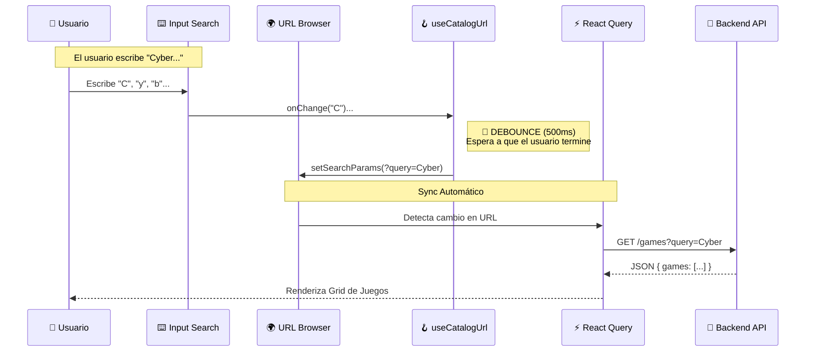

# 🎓 Master Class: Architecture of a Production-Grade Search Engine

> **Nivel**: Senior Logic / Architect
> **Estado**: Implementado & Verificado ✅
> **Objetivo**: Desglosar la ingeniería detrás del motor de búsqueda de Game Manager. Este documento no solo explica _cómo_ se hizo, sino _por qué_ es la solución estándar de la industria.

## 🧠 Mapa Mental (The Flow)

Antes de ver código, entendamos el flujo de datos. En una arquitectura profesional, **la UI nunca habla directamente con la API**; la UI actualiza la URL, y la API reacciona a la URL.



---

## 🏛️ Backend Architecture: Determinismo & Flexibilidad

El backend debe ser capaz de responder preguntas complejas ("Juegos de RPG lanzados en 2023 ordenados por precio") de manera eficiente.

### 1. Estrategia de Búsqueda Flexible (`$or` vs `$text`)

Decidimos usar **Regex sobre múltiples campos** mediante el operador `$or`.

**¿Por qué?**

- **Full Text Search (FTS)** de MongoDB es potente pero estricto con las palabras exactas.
- **Regex** es más "humano": Permite encontrar "Cyberpunk" escribiendo "Cyber".
- **Multi-campo**: Al buscar en `title`, `genre` y `developer` a la vez, creamos una experiencia "Google-like".

```typescript
// backend/components/game/game.service.ts

// 🧠 Logic: Crear una expresión regular "case insensitive"
const regex = { $regex: query, $options: "i" };

// 🛡️ Pattern: Array de condiciones OR
const queryFilter = {
  $or: [
    { title: regex }, // Busca en título
    { genre: regex }, // Busca en género (ej: "RPG")
    { developer: regex }, // Busca por creador
    { platform: regex }, // Busca por consola
  ],
};
```

### 2. Paginación Determinista (The "Ghost Sort")

Un error de novato es ordenar solo por un campo que puede tener duplicados (como el precio o la fecha).

**El Problema**:
Si tienes 50 juegos con precio $59.99, MongoDB no garantiza en qué orden los devuelve. Al pasar de página 1 a 2, podrías ver el mismo juego repetido o saltarte alguno.

**La Solución (Tie-Breaker)**:
Siempre agregamos `_id` (que es único) como criterio de desempate final.

```typescript
// ✅ CORRECTO: Orden estable garantizado
const sortOptions = {
  price: -1, // Principal: Más caros primero
  _id: 1, // Secundario: Tie-breaker único
};
```

---

## 🎨 Frontend Architecture: URL as Source of Truth

En el frontend, adoptamos la filosofía **"Si no está en la URL, no existe"**.

### 1. El mito del `useState` local

Un error común es guardar la búsqueda en un estado local (`useState`).

- ❌ **Mal**: El usuario refresca la página y pierde su búsqueda.
- ✅ **Bien**: La URL contiene el estado (`?query=mario`). Al refrescar, React lee la URL y restaura la vista exacta.

### 2. La importancia del Debounce (Suavizado)

Imagina buscar "Minecraft". Son 9 caracteres.

- Sin debounce: 9 peticiones a la API en < 1 segundo. 📉
- Con debounce: 1 petición al terminar de escribir. 📈

Implementamos esto en `useCatalogUrl.ts` usando `lodash.debounce`.

```typescript
// frontend/hooks/useCatalogUrl.ts
const updateUrl = debounce((term) => {
  setSearchParams({ query: term });
}, 500); // Espera 500ms de inactividad
```

---

## 🛡️ Patrones de Prevención de Errores (Anti-Patterns)

Cosas que evitamos explícitamente en esta implementación:

### 🚫 Anti-Pattern 1: "useEffect Chaining"

```javascript
// ❌ PEOR PRÁCTICA
useEffect(() => {
  setSearch(term);
}, [term]);
useEffect(() => {
  api.call(search);
}, [search]);
```

**Solución**: Usar **React Query**. La query depende de la variable; cuando la variable cambia, React Query se encarga (cache, reintentos, validación).

### 🚫 Anti-Pattern 2: Resetear Paginación Manualmente

Al cambiar un filtro (ej: de "Acción" a "RPG"), si estabas en la página 5, podrías ver una pantalla vacía porque "RPG" solo tiene 2 páginas.
**Solución**: Nuestro hook `useCatalogUrl` resetea automáticamente `page=1` cada vez que cambia `query`, `genre` o `sort`.

---

## 🧪 Cómo verificar la calidad (QA Scripts)

### Prueba de Estrés (Debounce)

1.  Abre Network Tab en DevTools.
2.  Escribe "The Witcher 3" rápido.
3.  ✅ **Pass**: Solo ves **1 petición** al final.
4.  ❌ **Fail**: Ves una petición por cada letra (T, Th, The...).

### Prueba de Persistencia

1.  Filtra por "RPG", ordena por "Precio" y ve a la página 2.
2.  Copia la URL y ábrela en una pestaña de incógnito.
3.  ✅ **Pass**: Ves exactamente los mismos juegos.

---

> **Referencias Académicas / Documentación**:
>
> - [Deboucing Explanation (Visual)](https://css-tricks.com/debouncing-throttling-explained-examples/)
> - [MongoDB Text Search vs Regex](https://www.mongodb.com/docs/manual/reference/operator/query/regex/)
> - [React Query Docs: Paginated Queries](https://tanstack.com/query/v4/docs/react/guides/paginated-queries)
